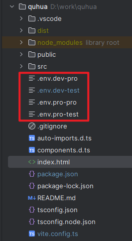
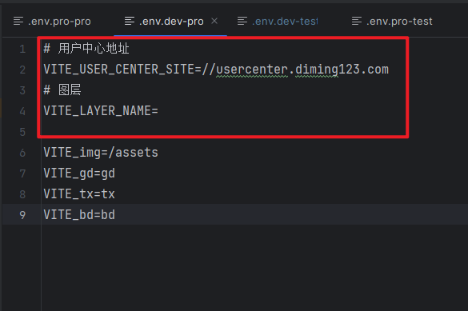
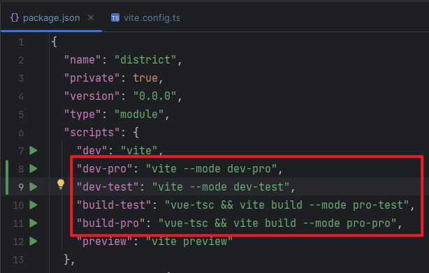

# vite 环境变量和模式

加载的环境变量会通过 `import.meta.env` 以字符串形式暴露给客户端源码。

为了防止意外地将一些环境变量泄漏到客户端，只有以 `VITE_` 为前缀的变量才会暴露给经过 vite 处理的代码。

```
VITE_SOME_KEY=123
```



| .env.dev-pro  | 本地正式环境 |
| ------------- | ------------ |
| .env.dev-test | 本地测试环境 |
| .env.pro-pro  | 打包正式环境 |
| .env.pro-test | 打包测试环境 |

